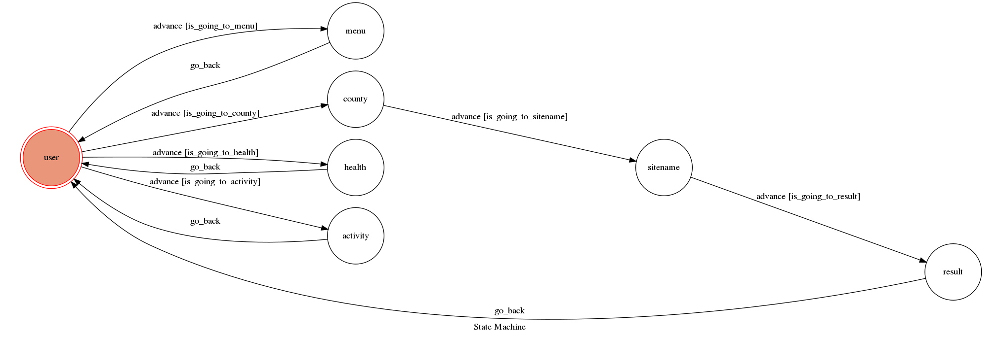

# Line Chatbot
Theory of Computation class final project
A Line bot based on a finite state machine
主題:空汙
## Setup

### Prerequisite
* Python 3.6
* Pipenv
* Facebook Page and App
* HTTPS Server

#### Install Dependency
```sh
pip3 install pipenv

pipenv --three

pipenv install

pipenv shell
```

* pygraphviz (For visualizing Finite State Machine)
    * [Setup pygraphviz on Ubuntu](http://www.jianshu.com/p/a3da7ecc5303)
	* [Note: macOS Install error](https://github.com/pygraphviz/pygraphviz/issues/100)


## Feature
* deploy on Heroku
* parse data from [政府資料開放平台](https://data.gov.tw/dataset/40448)

## Finite State Machine


## Usage
The initial state is set to `user`.

Every time `user` state is triggered to `advance` to another state, it will `go_back` to `user` state after the bot replies corresponding message.

* user
	* Input: "menu"
		* Go to "menu"
	* Input: "查詢空氣品質"
		* Go to "county"
	* Input: "AQI:(你要查詢的值) 對健康影響"
		* Go to "health"
	* Input: "AQI:(你要查詢的值) 活動建議"
		* Go to "activity"
		
* menu
	* Reply:
		1.輸入 查詢空氣品質 ,可查各地區的AQI值
		2.輸入 AQI:(你要查詢的值) 對健康影響		
		3.輸入AQI:(你要查詢的值) 活動建議
	* Go back to "user"

* health
	* Reply:根據AQI的值回傳圖片
	* Go back to "user"

* activity
	* Reply:根據AQI的值回傳圖片
	* Go back to "user"
* county
	* Reply:請輸入想要查詢的縣市
	* Input:縣市名稱(ex:花蓮縣、臺南市)
	* Go to "sitename"
* sitename
	* Reply:請選擇想要查詢的地區(會列出該縣市有的地區提供選擇)
	* Input:地區名稱(ex:中壢)
	* Go to "result" 
* result
    * Reply:AQI值:(parsing到的值)
    * Go back to "user"  
		


	refference: https://hackmd.io/@ccw/B1Xw7E8kN?type=view#Q2-如何在-Heroku-使用-pygraphviz

## Reference
[Pipenv](https://medium.com/@chihsuan/pipenv-更簡單-更快速的-python-套件管理工具-135a47e504f4) ❤️ [@chihsuan](https://github.com/chihsuan)

[TOC-Project-2019](https://github.com/winonecheng/TOC-Project-2019) ❤️ [@winonecheng](https://github.com/winonecheng)

Flask Architecture ❤️ [@Sirius207](https://github.com/Sirius207)

[Line line-bot-sdk-python](https://github.com/line/line-bot-sdk-python/tree/master/examples/flask-echo)
